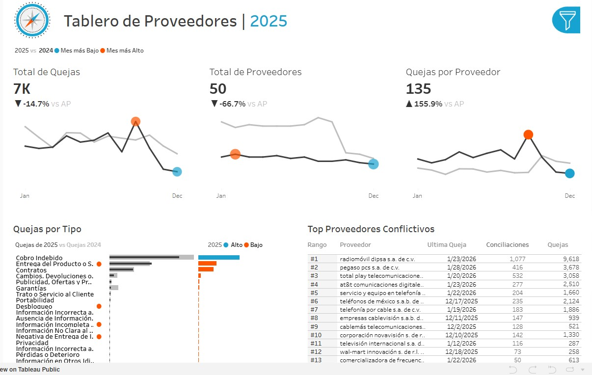

## 📈 Tableau (Visualizacion)
- **Dashboard interactivo**
- **Análisis temporal de las quejas**
- **Ranking de proveedores**
- **Principales tipos y motivos de reclamación**
---

## 🖥️ Enlace Interactico al Tablero en Tableau Public 
https://public.tableau.com/app/profile/edgar.martinez3401/viz/QuejasProveedoresTelecomunicaciones/TablerodeProveedores
---

## 📂 Estructura
```
Tableau/
├── tablero_quejas_telecom.jpg          # Screenshot del tablero
├── tablero_quejas_telecom.twbx         # El archivo del workbook de Tableau
├── quejas_telecom.csv                  # El conjunto de datos utilizado para la visualización
├── historia_usuario.md                 # Requerimientos del usuario final
└── README.md                           # Descripción general del proyecto y enlace al tablero
```
---
